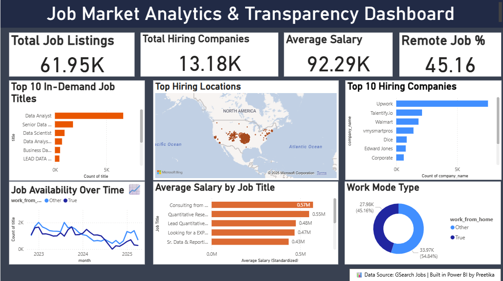

# 🧭 Job Market Analytics & Transparency Dashboard

### 🎯 Problem Statement
In today's competitive job market, job seekers lack clear insights into in-demand roles, locations, and salary ranges — while recruiters struggle to understand hiring trends.

This project analyzes **real-world job listings data** to bring transparency into the job market through an **interactive Power BI dashboard**.

---

## 📊 Project Overview
**Goal:** Build a data-driven dashboard to uncover job market trends — helping both job seekers and recruiters make informed decisions.

**Key Objectives:**
- Identify top hiring companies  
- Find most in-demand job titles  
- Compare salary ranges across roles  
- Understand remote vs on-site job distribution  
- Analyze job posting trends over time  

---

## 🧩 Dataset Details
- **File Used:** `gsearch_jobs_clean.xlsx` (original large dataset)  
- **Sample Provided:** `gsearch_jobs_sample.xlsx` (for GitHub upload)  
- **Source:** Kaggle — *Google Search Job Dataset*

---

## 🧰 Tools & Technologies Used
| Tool | Purpose |
|------|----------|
| 🐍 Python (Pandas) | Data cleaning & preprocessing |
| 📈 Power BI | Dashboard visualization |
| 📊 Excel | KPI summary and aggregation |
| 💾 GitHub | Project version control & portfolio hosting |

---

## 🔑 Key KPIs
| KPI | Description |
|------|-------------|
| Total Job Listings | Total number of job postings |
| Top Hiring Companies | Companies with most openings |
| Top Job Titles | Most frequently listed job roles |
| % Remote Jobs | Share of work-from-home listings |
| Average Salary | Mean standardized salary |
| Jobs by Schedule | Full-time vs Contractor vs Part-time |
| Posting Trend | Job listings trend over time |

---

## 📊 Dashboard Overview

**Visuals Included:**
- 📈 *Top 10 Job Titles* (Bar chart)  
- 🏢 *Top Hiring Companies* (Clustered bar)  
- 🏠 *Remote vs On-site Jobs* (Donut chart)  
- 💰 *Average Salary by Role* (Bar chart)  
- ⏱ *Job Posting Trend Over Time* (Line chart)  
- 🧮 KPI Cards – Total Jobs, Avg Salary, % Remote, Top Companies  

---

## 📂 Project Structure
├── Job_Analytics_Jupyter.ipynb # Python data cleaning
├── gsearch_jobs_sample.xlsx # Sample dataset
├── kpi_summary.xlsx # KPI calculations
├── Job_Transparency_Dashboard.pbix # Power BI dashboard file
├── Job_Transparency_Dashboard.png # Dashboard screenshot
└── README.md # Project documentation

---

## 📈 Insights Summary
- **Top Job Role:** Data Analyst  
- **Top Hiring Company:** Upwork  
- **% Remote Jobs:** ~45%  
- **Average Salary:** $42,100  
- **Trend:** Job postings peaked in Jan 2023  

---

## 👩‍💻 Author
**Preetika**  
Data Analyst | Power BI & Python Enthusiast  
📧 Email: [preetika0002@gmail.com](mailto:preetika0002@gmail.com)  
🔗 LinkedIn: [www.linkedin.com/in/preetika20](https://www.linkedin.com/in/preetika20)  

---

## 🗂 Data Source
- **Dataset:** Google Search Jobs (via Kaggle)
